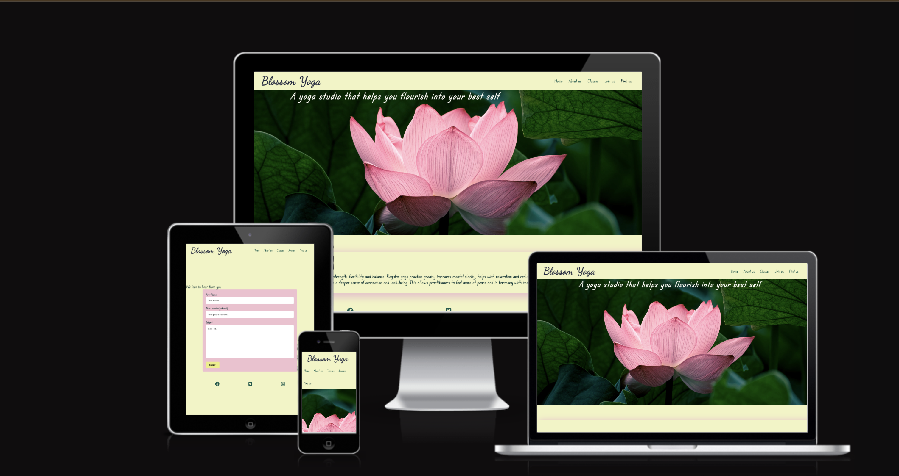
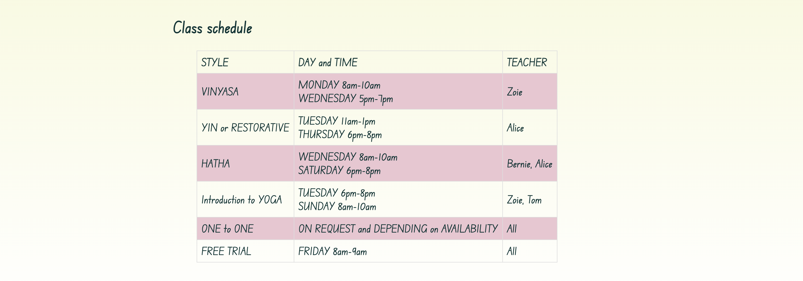
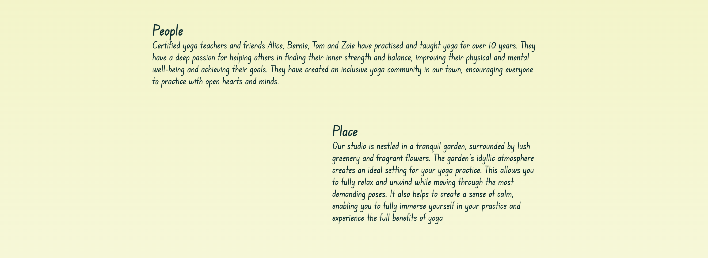
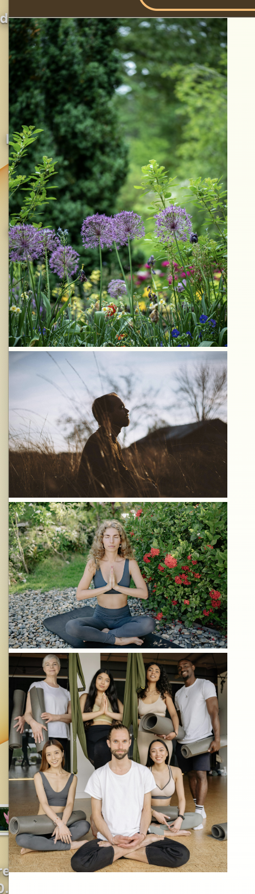
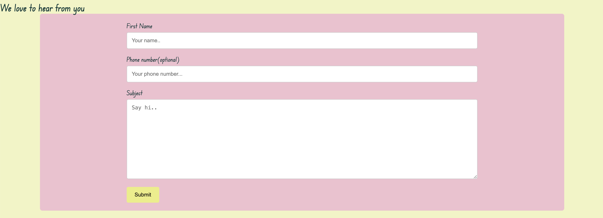

  # Blossom Yoga

Blossom Yoga is the perfect site for anyone looking to enhance their wellbeing through a rejuvenating and invigorating yoga session in Egham area. Connect with your community at our local studio settled in a lush garden through yoga sessions and enjoy the breathtaking scenery while you stretch and strengthen your body. Join us now and experience the benefits of yoga. Connect with  people from your local community and with nature.

## Features 

### Existing Features

- __Navigation Bar__

  - Featured on all four pages, the full responsive navigation bar includes links  to Home page, About us, Classes, Join us, Find us page and is identical in each page to allow for easy navigation.
  - This section allows to navigate between pages  by eliminating the need for users to rely on the "back" button. It can  greatly simplify browsing experience.
  - Find us link takes the user to Footer with social links.

- __The landing page image__

  - The landing page of Blossom Yoga Studio features a photograph with an animated picture of a pink lotus that zooms in over a few seconds. This eye-catching feature captures the user's attention, builds interest, and encourages them to explore more content.
  - The warm and inviting intentions of the Studio are highlighted by the dominant pink, yellow, and green colours. 
  - The overlay motto inspires and emphasizes the main goal of Blossom Yoga Studio, which is to connect with nature and achieve inner balance.

- __Benefits of yoga__

  - The landing page features a paragraph of text that focuses on the advantages of practicing yoga. 

- __Classes section__

  - This section presents all styles of yoga the Studio offers along with a brief explenation of each .
  - Class schedule informs of Yoga styles, days and times and teachers running particular classes.

- __About us__

 - This section introduces the two primary elements that make up the concept of Blossom Yoga Studio: the people and the place. The creators of the studio, along with the setting, work together to create a distinct and unique experience for the local community who become a part of it.
 - The images presents people in yoga poses in garden setting and a relaxed, happy group of people: the teachers with their students.

- __The Footer__ 

  - The footer section of Blossom Yoga Studio contains links to their social media profiles. These links will open in a new tab to ensure a smooth browsing experience for the user. 
  - The footer provides a convenient way for the user to stay connected with Blossom Yoga via social media.

- __Contact page__

  - This page will allow the users to contact Blossom Yoga Studio. By a friendly and inviting manner asks to submit their name and optional phone number. It allows to leave any comments, suggestions or questions  a potential visitor to the webstite would have. 

### Features Left to Implement

- To improve UX create and add 404 page.
- To add more content about competitions and other social events related to yoga and community.
- To add icons representing a lotus flower or a yoga pose around the whole document.
- To imrove responsivness add Media queries 

## Testing
### Validator Testing 

- HTML
  - No errors were returned when passing through the official [W3C validator](https://validator.w3.org/nu/?doc=https%3A%2F%2Fcode-institute-org.github.io%2Flove-running-2.0%2Findex.html)
- CSS
  - No errors were found when passing through the official [(Jigsaw) validator](https://jigsaw.w3.org/css-validator/validator?uri=https%3A%2F%2Fvalidator.w3.org%2Fnu%2F%3Fdoc%3Dhttps%253A%252F%252Fcode-institute-org.github.io%252Flove-running-2.0%252Findex.html&profile=css3svg&usermedium=all&warning=1&vextwarning=&lang=en#css)
  - Accessibility , performance and SEO is satisfactory and tested via Lighthouse in Dev Tools
  [Lighthouse ](media/lighthouse.png)

### Unfixed Bugs

- The page About us contains two paragraphs of text and pictures. I wanted them to be positioned below the text in the form of a responsive box. I suspect I wasn't able to achieve this as the main content on the page(text) is styled with Flexbox. The idea is to restructure, restyle the whole page again.

- The site responds well in various dimensions  despite Media queries not present 

## Deployment

- The site was deployed to GitHub pages. The steps to deploy are as follows: 
  - In the GitHub repository, navigate to the Settings tab 
  - From the source section drop-down menu, select the Master Branch
  - Once the master branch has been selected, the page will be automatically refreshed with a detailed ribbon display to indicate the successful deployment. 

- The live link can be found here - https://annam-salamon.github.io/blossom-yoga-studio/

## Credits 
 

### Content 

- The text for all pages was created, checked for correctness with a help of[Grammarly] (https://app.grammarly.com/)
- Instructions on how to construct Class schedule table and Contact form as well as 404 error page and other ideas for styling with css are from [w3schools] (https://www.w3schools.com/)
- The Footer and Readme.md  was inspired by [Code InstituteLove Running Essential Project](https://learn.codeinstitute.net/courses/course-v1:CodeInstitute+LRFX101+2/courseware/e805068059af42af87681032aa64053f/7525117e5cd144daa2a7b0c57843bbee/?child=first) and[Readme Template Love Running](https://github.com/Code-Institute-Solutions/readme-template)

### Media

- The photos of Lotus Flower used on landing page and in Favicon creation are from [Unsplash](https://unsplash.com/s/photos/lotus-flower?license=free)
- The images used for the About us page, 404 error page were taken from [Unsplash](https://unsplash.com/), [Pexels](https://www.pexels.com/)
- Favicon was created thanks to [Real Favicon Generator](https://realfavicongenerator.net/)

